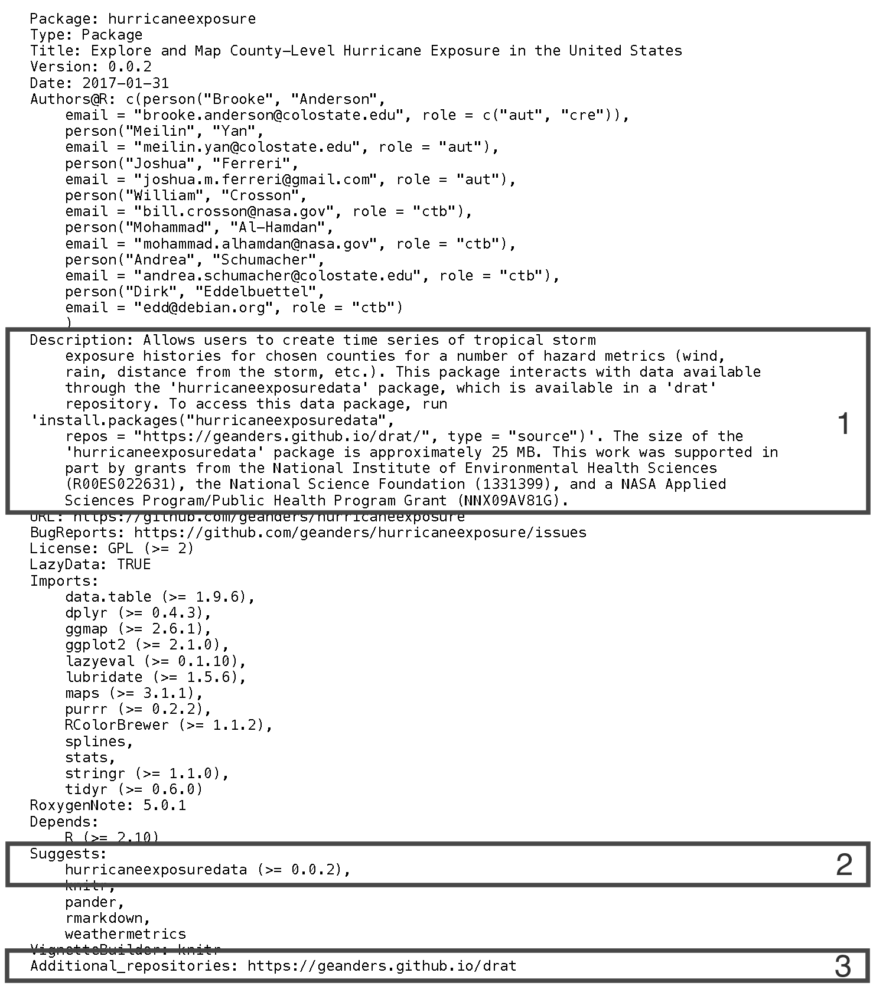

# Motivation

"Big data", apart from being a buzzword, also accurately describes the current scale of many
scientific data sets. While the R language and environment \citep{rcore:rbase} enables the creation,
use, and sharing of data packages to support methodology or application packages, the size of these
data packages can be very large. The Bioconductor project has addressed the potentially large size
requirements of data packages through the use of Git Large File Storage, with the package contributor covering costs for extremely
large data packages (over 1 gigabyte) \citep{biocPkgGuide}. The Bioconductor
repository, though, is restricted to topic-specific packages related to bioinformatics. The Comprehensive R Archive Network (CRAN), which archives R packages on any topic, has a
recommended size limit (reasonable for a widely-mirrored repository) of 5 megabytes (MB) for package
data and documentation \citep{rcore:wre}. A twofold need therefore arises for package maintainers
seeking to share large R data packages that are outside the scope of the Bioconductor
project. First, there is a need to create and share such a data package for integration into and extensions of
a given methodology or application package, and, second, there is a need to integrate use of such a
package in a way that makes it seamlessly integrated with smaller CRAN packages that use the 
data package. Here, we outline one possible approach to satisfy these needs by creating a suite of
coordinated packages, in which larger data packages are hosted outside of CRAN but can still be accessed by smaller
code packages that are submitted to CRAN.

The problem of creating CRAN packages that interface with large datasets is not new, and various
approaches have been taken in the past to allow for such an interface. For example, the
\pkg{NMMAPSlite} package (currently available only from the CRAN archive) was built to allow users
to interact with daily data on weather, air pollution, and mortality outcomes for over 100 US
communities over 14 years \citep{peng2008statistical}. To enable interaction with this large dataset
through a CRAN package, the package maintainer posted the data on a server and included functions in
the \pkg{NMMAPSlite} package to create an empty database on the user's computer and fill it
with community-specific datasets as the user queried different communities. This data
interaction was enabled with the \CRANpkg{stashR} package by the same maintainer \citep{stashR}.

More recent packages similarly allow interaction between a web-hosted database and R, in some cases
for a database maintained by an outside entity. For example, the \CRANpkg{rnoaa} package allows
access to weather data posted by the National Oceanic and Atmospheric Administration (NOAA)
\citep{rnoaa}, while the \CRANpkg{tigris} package allows access to spatial data from the United
States Census Bureau \citep{tigris}. Both packages are posted on CRAN and allow R users to work with
a large collection of available online data by creating and sending HTTP requests from R using
the conventions defined in the respective online databases' application program interfaces (APIs). This
approach is a good one for data that is already available through an online database, especially if
the database is outside the control of the R package maintainer or if the potential set of data is
extremely large and it is unlikely that an R user would want to download all of it, since an API allows
an R user to selectively download parts of the data. However, if the data is not already available
through an online database, this approach would require the R package maintainer to create and
maintain an online database, including covering the costs and managing the security of that
database.

Another approach is to create a suite of packages, in which smaller ('code') packages are submitted
to CRAN while larger ('data') packages are posted elsewhere. With this approach, the R user
downloads all the data in the data package when he or she installs the data package, effectively
caching this data locally so that data can be used in different R sessions without reloading or
when the computer is offline. This can be a good approach in cases where the data is not otherwise
available through an online database and when R users are likely to want to download the full set of
data. In this case, this second approach offers several advantages, including: (1) the data can be
documented through package helpfiles that are easily accessible from the R console; (2) if
a user would like to delete all downloaded data from their computer, he or she can easily do so by
removing the entire data package with \code{remove.packages} (as compared to other caching
solutions, in which case the user might need to do some work to determine where a package cached
data on his or her computer); (3) versioning can be used for the data package, which can improve
reproducibility of research using the data \citep{gentleman2004bioconductor}; and (4) the data
package can include the R scripts used to clean the original data (for example, in a \file{data-raw}
directory, with the directory's name excluded from the R package build through a listing in the
\file{.Rbuildignore} file), which will make the package more reproducible for the package author
and, if the full package directory is posted publicly (e.g., through a public GitHub repository),
for other users.

The \pkg{UScensus2000} suite of packages (currently available from the CRAN archive) used this
approach to allow access to U.S. Census Bureau data from the 2000 Decennial Census
\citep{almquist2010us}. This suite of packages included data at a more aggregated spatial level
(e.g., state- and county-level data) through data packages submitted to CRAN, but included the
largest dataset (block-level data) in an R package that was instead posted to the research lab's
website \citep{almquist2010us}. A convenience function was included in one of the CRAN packages in
the suite to facilitate installing this data package from the lab's website \citep{almquist2010us}.

This approach can be facilitated by posting the data package through an online package repository rather than a non-repository website. While
support for repositories outside of CRAN, Bioconductor, and OmegaHat has existed within R for years,
few users appear to have deployed this mechanism to host additional repositories. The \CRANpkg{drat}
package facilitates the creation and use of a user-controlled package repository. Once a package
maintainer has created a repository, he or she can use it to host larger packages like a data
package (and of course also any number of code packages). Use of
a \pkg{drat} repository allows R users to install and update the data package using traditional R functions for managing packages
(e.g., \code{install.packages}, \code{update.packages}) after the user has added the \pkg{drat}
repository through a call to \code{addRepo} \citep{drat}. A \pkg{drat} repository can be published
online through Git Pages, and GitHub repositories have a recommended maximum size of 1 GB, much
larger than the size limit for a CRAN package, with a cap of 100 MB on any single file
(\url{https://help.github.com/articles/what-is-my-disk-quota/}). Even for data packages below the CRAN
size limit, this approach to hosting data packages can help remove some of the burden of hosting and
archiving large data packages from CRAN. Although the \pkg{drat} package is
relatively new, some package maintainers are already taking this approach---for example, the
\CRANpkg{grattan} package facilitates research in R on Australian tax policy, with relevant data
available through the large \pkg{taxstats} data package, posted in a \pkg{drat} repository.

When taking the approach of creating a suite of packages in which the smaller code package or
packages are submitted to CRAN while larger data packages are hosted in \pkg{drat} repositories,
it is necessary to add some infrastructure to the smaller code packages.  CRAN policies do not allow the
submission of a package with mandatory dependencies on packages hosted outside of a mainstream
repository, which means that the smaller package could not be submitted to CRAN if the data package
is included in the smaller package through 'Imports:' or 'Depends:'. The R
package ecosystem offers a solution: a package maintainer can create a weaker relationship between
code and data packages via a 'Suggests:', which makes the data package optional, rather than
mandatory, as either 'Imports:' or 'Depends:' would. Being optional, one then has to condition any
code in the code package that accesses data in the data package on whether that package is
present on the user's system. This approach offers the possibility of posting a data package that is
too large for CRAN on a non-mainstream respository, like a \pkg{drat} repository, while
submitting a package that interacts with the data to CRAN. 

This paper outlines in sufficient detail the steps one has to take to use \pkg{drat} to host a
large data package for R and how to properly integrate conditional access to such an optional
data package into a smaller code package. The packaging standard aimed for is the CRAN Repository
Policy and the passing of \samp{R CMD check --as-cran}. Broadly, these steps are:

1. Create a \pkg{drat} repository;
2. Create the data package(s), build it, and post it in the \pkg{drat} repository; and
3. Create / alter the code package(s) to use the data package(s) in a way that complies with CRAN checks.

As a case study, we discuss and illustrate the interaction between the packages \pkg{hurricaneexposure}
\citep{hurricaneexposure} and \pkg{hurricaneexposuredata} \citep{hurricaneexposuredata}.  The latter
package contains data for eastern U.S. counties on rain, wind, and other hurricane exposures,
covering all historical Atlantic-basin tropical storms over a few decades. The total size of the
package's source code is approximately 25 MB, easily exceeding CRAN's package size limit. This
package includes only data, but the companion package, \pkg{hurricaneexposure}, provides functions to
map and interact with this data. The \pkg{hurricaneexposure} package is of standard size and
available from CRAN since the initial version 0.0.1, but to fully utilize all its capabilities
requires access to the data in package \pkg{hurricaneexposuredata}. Here, we highlight specific
elements of code in these packages that allow coordination between the two. The full code for both
packages is available through GitHub repositories
(\url{https://github.com/geanders/hurricaneexposure} and
\url{https://github.com/geanders/hurricaneexposuredata}); this article references code in
version 0.0.2 of both packages.

# Posting a data package to a drat repository

## Creating a drat repository

A package maintainer must first create a \pkg{drat} repository if he or she wishes to host packages through one. Essentially, this repository is a way to store R packages such that it is easy for R users to download and update the packages; the repository can be shared, among other ways, through a GitHub-hosted website. Because a \pkg{drat} repository is controlled by the package maintainer, it allows increased flexibility to package maintainers compared to repositories like CRAN.  A single \pkg{drat} repository can host multiple packages, so a maintainer likely only needs a single \pkg{drat} repository, regardless of how many packages he or she wishes to host on it. 

A \pkg{drat} repository is essentially a network-accessible directory structure. The \pkg{drat} repository's directory must include index files (e.g., \file{PACKAGES} and \file{PACKAGES.gz}; Figure \ref{fig:dratstructure}), which have metadata describing the
packages available in the repository. The directory structure should also store files with the source code of one or more packages (e.g., \file{hurricaneexposuredata\_0.0.2.tar.gz}) and can also include operating system-specific package code (e.g., \file{hurricaneexposuredata\_0.0.2.zip}). Multiple versions of a package can be included (e.g., \file{hurricaneexposuredata\_0.0.1.tar.gz} and \file{hurricaneexposuredata\_0.0.2.tar.gz} in Figure \ref{fig:dratstructure}), allowing for archiving of old packages.

A user can create a \pkg{drat} directory with the required structure either by
hand, via functions in the \pkg{drat} package, or by copying an existing \pkg{drat} repository
(e.g., forking one on GitHub, like the original drat repository available at
\url{https://github.com/eddelbuettel/drat}). While this directory can have any name, we suggest the user name the directory \file{drat}, as this allows the easy use of default
variable names (which can of course be overridden as needed) for functions in the \pkg{drat} package, as shown in later code examples.

Second, for other users to be able to install packages from a \pkg{drat} repository, the repository must be available
online. This can be easily achieved via the https protocol using GitHub's Git Pages, which allows
GitHub users to create project webpages by posting content to an \file{gh-pages} branch of the
project's repository. (While there are now ways to publish content from a directory \file{docs/} in
the \file{master} branch, functions in the \pkg{drat} package currently only support use of the
older \file{gh-pages} publishing option). Once this \file{gh-pages} branch is pushed, the content in
that branch will be available as part of the GitHub user's Git Pages website. For example, if the
project is in the GitHub repository \file{https://github.com/username/projectname}, the content from
the \file{gh-pages} branch of that repository will be published at
\file{https://username.github.io/projectname}. 

\begin{figure}
\begin{center}
\includegraphics{images/drat_repo_structure.pdf}
\end{center}
\caption{Example of the structure of the directory for a \pkg{drat}
repository for a repository with two versions (0.0.1 and 0.0.2) of
\pkg{hurricaneexposuredata}. Directories and files shown in black are
required while those in blue are optional. This example \pkg{drat} depository
has source code available for the \pkg{hurricaneexposuredata}, as well as the
binaries for Windows (the binaries for Mac OS X could also be included but are 
not shown in this example),
through the optional \file{bin} subdirectory. The top-level \file{index.html}
file can be used to customize the appearance of the webpage a user would see
at \file{https://username.github.io/drat}. Functions from the \pkg{drat}
package automate the insertion of compressed package files (\file{.tar.gz}
for source code files, \file{.tgz} for Mac OS X binaries, and \file{.zip} for
Windows binaries) within this directory structure. The \file{PACKAGES} and
\file{PACKAGES.gz} files serve as index files, with metadata about packages
available in the repository, and are created by \code{drat::insertPackage}
via a call to the R function \code{tools::write\_PACKAGES}.} 
\label{fig:dratstructure}
\end{figure}

Once this \pkg{drat} repository is created and published online through Git Pages,
any source code or binaries for R packages within the repository can be installed and updated by R users through functions in the \pkg{drat} package. An R user
can install a package from a \pkg{drat} repository by first adding the \pkg{drat} respository using the \code{addRepo} function from
\pkg{drat}, with the appropriate GitHub username, and then using \code{install.packages}, as one
would for a package on CRAN. The \pkg{drat} package documentation, including several vignettes, as well as supplementary
webpages, have more detail on this process; see \citet{drat}.

## Creating and building a data package

The next step is to create an R data package that contains the large dataset; this data package will be posted in the \pkg{drat} repository to be accessible to other R
users.  In the case study
example, this package is called \pkg{hurricaneexposuredata} and includes data on rain, wind, flood,
and tornado exposures for all eastern US counties for Atlantic-basin tropical storms between 1988
and 2015. For full details on creating R packages, including data-only packages, see the canonical
reference by
\citet{rcore:wre}; another popular reference is \citet{wickham2015r}.  

If a package is hosted in a \pkg{drat} repository rather than posted to CRAN, it does not have to
pass all tests executed by \samp{R CMD check}. However, it is good practice to resolve as many
ERRORS, WARNINGS, and NOTES from CRAN checks as possible for any R package that will be shared with
other users, regardless of how it is shared. Several possibilities exist to build and check a
package so these ERRORS, WARNINGS, and NOTES can be identified and resolved. The standard approach is to
execute \samp{R CMD build} from one directory above the source directory (as discussed below),
followed by \samp{R CMD check} with the resulting tar archive (e.g., \code{hurricaneexposuredata.tar.gz}) as first argument. The optional switch
\samp{--as-cran} is recommended in order to run a wider variety of tests.  Other alternatives for checking the package are to use
the \code{check} function from the \CRANpkg{devtools} package \citep{devtools}, the \code{rcmdcheck}
function of the eponymous \CRANpkg{rcmdcheck} package \citep{rcmdcheck}, the 'Check' button in the
Build pane of the RStudio GUI, or the RStudio keyboard shortcut Ctrl-Shift-E.  For a large data
package, it is desirable to resolve all issues except the NOTE on the package size being large.

Once the code in the data package is finalized, the package can be posted in a \pkg{drat} repository
to be shared with others. Packages are inserted into a \pkg{drat} repository as source code tarballs
(e.g., \file{.tar.gz} files); if desired, package binaries for specific operating systems can also
be inserted (e.g., \file{.zip} or \file{.tgz} files), but this is not required for the application
described here. To build a package into a \file{.tar.gz} file, there are again several possible
approaches. The most convenient one may be to build the package in a temporary directory created
with the \code{tempdir} function, as this directory will be cleaned up when the current R session is
closed. If the current working directory is the package directory, the package can be built to a
temporary directory with the \code{build} function from the \pkg{devtools} package:

```{r eval = FALSE}
tmp <- tempdir()
devtools::build(path = tmp)
``` 

While this function call assumes that the user is currently using the
directory of the data package as the working directory, the \code{pkg} option of the \code{build} function can be used
to run this call successfully from a different directory.  If the build is successful, a
\file{.tar.gz} file will be created containing the package's source code in the directory specified
by the \code{path} option; this can be checked from R with the call \code{list.files(tmp)}.

## Adding the data package to your drat repository

Once the source code of the package has been built, the data package can be inserted into the \pkg{drat}
repository using the \code{insertPackage} function from the \pkg{drat} package. This function
identifies the package file type (e.g., \file{.tar.gz}, \file{.zip}, or \file{.tgz}), adds the
package to the appropriate spot in the \pkg{drat} directory structure (Figure
\ref{fig:dratstructure}), and adds metadata on the package to the \file{PACKAGES} and
\file{PACKAGES.gz} index files (created by the R function \code{tools::write\_PACKAGES}) in the
appropriate subdirectory. Once this updated version of the \pkg{drat} repository is pushed to
GitHub, the package will be available for other users to install from the repository.

For example, the following code can be used to add version 0.0.2 of \pkg{hurricaneexposuredata} to
the \pkg{drat} repository. This code assumes that the \file{.tar.gz} file for the package was built
into a temporary directory with a path given by the R object \code{tmp}, as would be the case if the
user built the package tarball using the code suggested in the previous subsection, and that the
user is in the same R session as when the package was built (as any temporary directories created
with \code{tempdir} are deleted when an R session is closed). Further, this code assumes that the
user has the \CRANpkg{git2r} package installed and has stored their \pkg{drat} directory within the
parent directory `~/git`; if this is not the case, the correct path to the \pkg{drat} directory
should be specified in the \code{repodir} argument of \code{insertPackage}.

```{r eval = FALSE}
pkg_path <- file.path(tmp, "hurricaneexposuredata_0.0.2.tar.gz", sep = "/")
drat::insertPackage(pkg_path, commit = TRUE)
```

As mentioned before, only material in the \file{gh-pages} branch of the GitHub repository is
published through Git Pages, so it is important that the package be inserted in that branch of the
user's \pkg{drat} repository. The \code{insertPackage} function checks out that branch of the
repository and so ensures that the package file is inserted in the correct branch. However, it is
important that the user be sure to push that specific branch to GitHub to update the online
repository. If unsure, the \code{commit} option can be left at its default value of \code{FALSE},
permitting an inspection of the repository followed by a possible manual commit.

For users who prefer working from the command line, an alternative pipeline for building the data
package and inserting it into the \pkg{drat} repository is to run, from the command line:

```
R CMD build sourcedir/
dratInsert.r pkg_1.2.3.tar.gz
```

\noindent Note that this pipeline requires having
the \CRANpkg{littler} \citep{littler} package installed, as well as the \file{dratInsert.r} helper
for that package.

If desired, operating system-specific binaries of the data package can be built with tools like
win-builder (\url{http://win-builder.r-project.org/}) and rhub (\url{https://builder.r-hub.io}) and
then inserted into the \pkg{drat} repository. However, this step is not necessary, as \samp{R CMD
check --as-cran} will be satisfied for the code package as long as a source package is
available for any suggested packages stored in repositories listed in 'Additional_repositories'
\citep{rcore:wre}.

# Setting up a smaller code package to use the data package

So far, the process described is the same one would use to create and add any R package to a
\pkg{drat} repository.  However, if a package maintainer would like to coordinate a code package
that will be submitted to CRAN with a data package posted in a \pkg{drat} repository, it is necessary
to add some infrastructure to the code package (in our example, \pkg{hurricaneexposure}, which has functions for
exploring and mapping the data in \pkg{hurricaneexposuredata}). These additions
ensure that the code package will pass CRAN checks and also appropriately load and access the
data in the data package posted in the drat repository.

## Add infrastructure to the DESCRIPTION file

First, two additions are needed and a third is suggested in the DESCRIPTION file (Figure \ref{fig:descriptionelements}) of the code package that
will be submitted to CRAN:

```{r descriptionelements, echo = FALSE, fig.align = "center", fig.cap = "Example of the elements that should be added to the DESCRIPTION file of the code package planned to be submitted to CRAN to coordinate it with a data package posted to a \\pkg{drat repository}, showing the DESCRIPTION file for \\pkg{hurricaneexposure}. Elements are: (1) added details on installing the data package in the 'Description' field (suggested but not required); (2) suggested dependency on the data package in the 'Suggests' field; and (3) reference to the drat repository in the 'Additional\\_repositories' field.", out.width = "\\textwidth"}

```

<!-- DE: Should the png file be updated now that the package is at version 0.0.2, the license has been corrected to GPL (>= 2), and the author list expanded? -->
<!-- BA: I've now updated this figure. -->

1. We suggest the 'Description' field of the code package's \file{DESCRIPTION} file be modified to let users
   know how to install the data package and how large it is (this tip is inspired by the
   \CRANpkg{grattan} package; \citet{grattan}). Figure \ref{fig:descriptionelements} (#1) shows an
   example of this added information for the \pkg{hurricaneexposure} \file{DESCRIPTION} file. For a
   CRAN package, this 'Description' field will be posted on the package's CRAN webpage, so
   this field offers an opportunity to inform users about the data package before they install the
   CRAN package. This addition is not required, but is particularly helpful in cases where the data
   package is very large, in which case it would take up a lot of room on a user's computer and take a long time
   to install and load.

2. The 'Suggests' field for the code package must specify the suggested dependency on the data package (Figure
   \ref{fig:descriptionelements}, #2). Because the data package is in a non-mainstream repository,
   this dependency much be specified in the 'Suggests' field rather than the 'Depends' or 'Imports'
   field if the code package is to be submitted to CRAN. The 'Suggests' field allows version requirements, so if the code package requires either a minimum version or an exact version of the data package in the
   \pkg{drat} repository, this requirement can be included in this field.

3. The 'Additional_repositories' field of the code package must give the address of the \pkg{drat} repository that
   stores the data package (Figure \ref{fig:descriptionelements}, #3). This field is necessary if a
   package depends on a package in a non-mainstream repository. Repositories listed here are
   checked by CRAN to confirm their availability \citep{rcore:wre}, but packages from these
   repositories are not installed prior to CRAN checks. This repository address should be listed
   using \file{https:} rather than \file{http:}.

## Customize behavior when the package is loaded

When a package is installed, any packages listed as 'Imports' or 'Depends' in the package
\file{DESCRIPTION} file are guaranteed to be previously installed \citep{rcore:wre}; the same is not
true for packages in 'Suggests'. It is therefore important that the maintainer of any package that
suggests a data package from a \pkg{drat} repository take steps to ensure that the package does not
fail if it is installed without the data package being previously installed. Such steps include
adding code that will be run when the package is loaded (described in this subsection), as well as
ensuring that code in all functions, examples, vignettes, and tests be conditional on whether the data package is installed if the code requires data from
the data package (described in later
subsections).

First, the code package should have code to check whether the data package is installed when the
code package is loaded. This can be achieved through load hooks (\code{.onLoad} and
\code{.onAttach}), saved to a file named, for example, \file{zzz.R} in the \file{R} directory of the code
package (the name \file{zzz.R} dates back to a time when R required this; now any file name
can be chosen). For a concrete example, such a \file{zzz.R} file in the code package might look like
(numbers in comments of this code are used within specific comments later in this section):

\begin{verbatim}
.pkgenv <- new.env(parent=emptyenv())                                             #1

.onLoad  <- function(libname, pkgname) {                                          #2
    has_data <- requireNamespace("hurricaneexposuredata", quietly = TRUE)         #3
    .pkgenv[["has_data"]] <- has_data                                             #4
}

.onAttach <- function(libname, pkgname) {                                         #5
    if (!.pkgenv$has_data) {                                                      #6 
        msg <- paste("To use this package, you must install the",
                     "hurricaneexposuredata package. To install that ",
                     "package, run `install.packages('hurricaneexposuredata',",
                     "repos='https://geanders.github.io/drat/', type='source')`.",
                     "See the `hurricaneexposure` vignette for more details.")
        msg <- paste(strwrap(msg), collapse="\n")
        packageStartupMessage(msg)
    }
}

hasData <- function(has_data = .pkgenv$has_data) {                                #7
    if (!has_data) {
        msg <- paste("To use this function, you must have the",
                     "`hurricaneexposuredata` package installed. See the",
                     "`hurricaneexposure` package vignette for more details.")
        msg <- paste(strwrap(msg), collapse="\n")
        stop(msg)
    }
}

\end{verbatim}

First, this \file{zzz.R} file creates an environment called \code{.pkgenv} (#1 in example
code). This environment will be used to pass a Boolean variable of whether the data package is
available (#4) to other code in the package.

Next, this \file{zzz.R} file defines two functions called \code{.onLoad} and \code{.onAttach}. Both
functions have arguments \code{libname} and \code{pkgname} (#2, #5). The \code{.onLoad()} function,
triggered when code from the package is first accessed, should use \code{requireNamespace} to test
if the user has the data package available (#3). This value is stored in the package environment
(#4). When the package is loaded and attached to the search path, the \code{.onAttach()} function is called
(#5). This function references the stored Boolean and uses this stored value to print a start-up
message (using the \code{packageStartupMessage} function, whose output can be suppressed via
\code{suppressPackageStartupMessages}) for users who lack the data package (#6).

Finally, any functions in the package that use data from the \pkg{drat} data package should check
that the data package is available before running the rest of the code in the function. If the data
package is not available, the function should stop with a useful error message. One way to achieve this is to define a function in an R script file in the package, like the \code{hasData} function defined in the example code above, that checks for availability of the data
package and errors with a helpful message if that package is not installed (#7). This function should then be added within all of
the package's functions that require data from the data package.

## Condition code in the code package on availability of the data package

Next, it is important to ensure that code in the vignettes, examples, and tests of the package will
run without error on CRAN, even without the data package installed. When a package is submitted to
CRAN, the user first creates a tarball of the package source on his or her own computer. In this
local build, the vignette is rendered and the resulting PDF or HTML file is stored within the
\file{inst/doc} directory of the source code \citep{rcore:wre}. This is the version of the rendered
vignette that is available to users when they install the package, and so the vignette is rendered
using the packages and other resources available on the package maintainer's computer during the
package build. However, CRAN runs initial checks on a package submission, and continues to run
regular checks on posted packages, which include testing any executable code within the package
vignette or any examples or tests in the source code that are not explicitly marked to not run on CRAN (e.g.,
with \verb|\donttest{}| within example code). CRAN does not install suggested packages from
non-mainstream repositories before doing these checks. Therefore, code that requires data from a
data package in a \pkg{drat} repository would cause errors in these tests unless it is conditioned
to only run when the data package is available, as is recommended for any example or test code that
uses suggested packages \citep{rcore:wre}.

Therefore, if the code package contains a vignette, the vignette must be coded so that its code  will run without an error on systems that do not have the data package installed.  This can be
done by adding a code chunk to the start of the vignette. This code chunk will check if the data
package is installed on the system. If it is, the vignette will be rendered as usual, and so it will
be rendered correctly on the package maintainer's computer when the package is built for CRAN
submission. However, if the optional data package is not installed, a message about installing the
data package from the \pkg{drat} repository will be printed in the vignette, and all the following
code chunks will be set to not be evaluated using the \code{opts\_chunk} function from \CRANpkg{knitr} \citep{knitr}.

The following code is an example of the code chunk that was added to the beginning of the vignette
in the \pkg{hurricaneexposure} package, for which all code examples require the
\pkg{hurricaneexposuredata} package:

\begin{verbatim}
```{r echo = FALSE, message = FALSE}`r ''`
hasData <- requireNamespace("hurricaneexposuredata", quietly = TRUE)                #1
if (!hasData) {                                                                     #2
    knitr::opts_chunk$set(eval = FALSE)                                             #3
    msg <- paste("Note: Examples in this vignette require that the", 
                 "`hurricaneexposuredata` package be installed. The system",
                 "currently running this vignette does not have that package",
                 "installed, so code examples will not be evaluated.")
    msg <- paste(strwrap(msg), collapse="\n")
    message(msg)                                                                    #4
}
```
\end{verbatim}

In this code, the function \code{requireNamespace} is used to check if \pkg{hurricaneexposuredata}
is installed on the system (#1). It is necessary to run this function in the
vignette with the \code{quietly = TRUE} option; otherwise, this call will cause an error if
\pkg{hurricaneexposuredata} is unavailable. If \pkg{hurricaneexposuredata} is not available, the
result of this call is `FALSE`, in which case (#2) the chunk option `eval` is set to `FALSE` for all
following chunks in the vignette (#3) and a message is printed in the vignette explaining why code
chunks are not evaluated (#4).

Similarly, the code for examples in help files of the CRAN package should be adjusted so they only
run if the data package is available. It may also be helpful to users to include a commented message
on why the example is wrapped in a conditional statement. For example, for a function
that requires the data package the \verb|\examples{}| field
(or \code{@examples} tag if \CRANpkg{roxygen2} is used) might look like:

\begin{verbatim}
\examples{
    # Ensure that data package is available before running the example.
    # If it is not, see the `hurricaneexposure` package vignette for details
    # on installing the required data package.
    if (requireNamespace("hurricaneexposuredata", quietly = TRUE)) {
        map_counties("Beryl-1988", metric = "wind")
    }
}
\end{verbatim}

As alternatives, the code in the example could also either check the \code{.pkgenv[["has\_data"]]}
object created by code in the \file{zzz.R} file in the conditional statement, or the package
maintainer could create a helper function to in the \file{zzz.R} file to use for conditional running
of examples in the example code. However, the use of the \code{requireNamespace} call, as shown in
the above code example, may be the most transparent for package users to understand when working
through package examples. Code in package tests can similarly be
conditioned to only run if and only if the data package is available.

# Maintaining a suite of \pkg{drat} and CRAN R packages

Once a suite of coordinated CRAN and \pkg{drat} packages have been created, there are a few considerations a
package maintainer should keep in mind for maintaining the packages.

First, unlike a single package that combines data and code, a suite of packages
will require thoughtful coordination between versions of packages in the suite, especially as the packages
are updated. The 'Suggests' field allows the package maintainer to specify an exact version of the
data package required by a code package (e.g., using \samp{(== 0.0.1)} with the data package name in the `Suggests` field) or a minimum
version of the data package (e.g., \samp{(>= 0.0.1)}). If the data package is expected to only change
infrequently, the maintainer may want to use an exact version dependency in 'Suggests' and plan to
submit an updated version of the code package to CRAN any time the data package is updated. However,
CRAN policy recommends that package versions not be submitted more than once every one to two
months. Therefore, if the data package will be updated more frequently, it may make more sense to
use a minimum version dependency. However, the maintainer should be aware that, in this case,
package users may find that any changes in the structure of the data in the data package that
breaks functions in older versions of the code package may cause errors, without notifying
the user that the error can be resolved by updating the code package.

Second, while the maximum size of a GitHub repository is much larger than the recommended maximum
size of an R package, there are still limits on GitHub repository size. If a package maintainer uses
a \pkg{drat} repository to store multiple large data packages, with multiple versions of each, there
may be some cases where the repository approaches or exceeds the maximum allowable GitHub repository
size. In this case, the package maintainer may want to consider, when inserting new versions of the data package into the \pkg{drat} repository, changing the \code{action} option in
the \code{insertPackage} function to free repository space by removing older versions of the package or
packages. This, however, reduces reproducibility of research using
the data package, as older versions would no longer be available through an archive.

Further, while the CRAN maintainers regularly run code from examples and vignettes within packages
posted to CRAN, they do not install any suggested packages from non-mainstream
repositories before doing this. Since
much of the code in the examples and vignette are not run if the data package is not available under the approach we suggest,
regular CRAN checks will provide less code coverage than is typical for a CRAN package. Package
maintainers should keep this in mind, and they may want to consider alternatives for ensuring
regular testing of all examples in the code package. One option may be through use of a regularly
scheduled Cron Job through Travis CI to check the latest stable version of the code package.

It is important to note that, under the suggested approach, proper versioning of any data packages
hosted in a \pkg{drat} repository is entirely the responsibility of the owner of that repository. By
contrast, R users who install packages from CRAN can be confident that a version number of a package
is tied to a unique version of the source code. While versioning of R data packages can improve
research reproducibility \citep{gentleman2004bioconductor}, if the owner of the \pkg{drat}
repository is not vigilant about changing the version number for every change in the source code of
packages posted in the repository, the advantages of packaging the data in terms of facilitating
reproducible research are lost. Similarly, the repository owner is solely responsible for archiving
older versions of the package, unlike a CRAN package, for which archiving is typically ensured by
CRAN. In particular, for very large packages that are updated often, the size limitations of a
GitHub repository may force a repository owner to remove older versions from the archive.

# Conclusion

R packages offer the chance to distribute large datasets while also providing functions for
exploring and working with that data. However, data packages often exceed the suggested size of CRAN
packages, which is a challenge for package maintainers who would like to share their code through
this central and popular repository. Here, we suggest an approach in which the maintainer creates a
smaller code package with the code to interact with the data, which can be submitted to CRAN, and a
separate data package, which can be hosted by the package maintainer through a personal \pkg{drat}
repository. Although \pkg{drat} repositories are not mainstream, and so cannot be listed with an
'Imports' or 'Depends' dependency for a package submitted to CRAN, we suggest a way of including
the data package as a suggested package and incorporating conditional code in the executable code
within vignettes, examples, and tests, as well as conditioning functions in the code package to
check for the availability of the data package. This approach may prove useful for a number of R package maintainers, especially
with the growing trend to the sharing and use of open data in many of the fields in which R is
popular.

# Acknowledgements

We thank Martin Morgan and Roger Peng for comments and suggestion on an earlier draft of this
manuscript. This work was supported in part by a grant from the National Institute of Environmental
Health Sciences (R00ES022631).

\bibliography{anderson-eddelbuettel}
