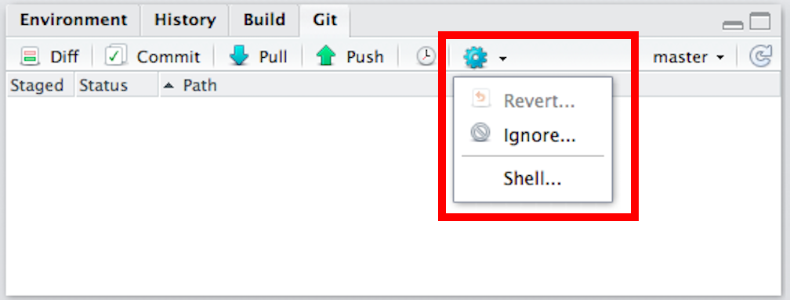
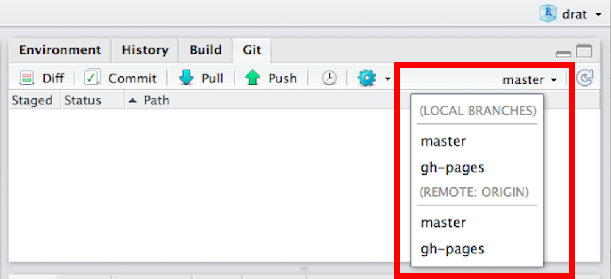
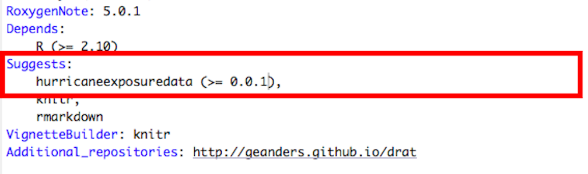
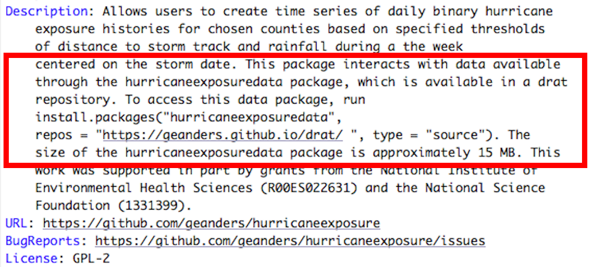

```{r setup, include=FALSE}
knitr::opts_chunk$set(echo = TRUE)
```

# Motivation

R data packages can be large enough to exceed CRAN size requirements, but you may still want to use the data as a dependency for a smaller package that you submit to CRAN. 

For example, I am working on a package called `hurricaneexposuredata` that includes data for U.S. counties on rain, wind, and some other exposures for all historical tropical storms over a couple of decades. This package includes only data, but I've written a package called `hurricaneexposure` with functions to map and interact with this data. The `hurricaneexposure` package is not very large, and I'd like to post it to CRAN, but it completely depends on being able to access the data on `hurricaneexposuredata`, which I'd like to store in a drat repository given its large size. 

This document outlines the steps you can take to use drat to host a larger data R package that you use within a package you plan to submit to CRAN. Broadly, the steps involved are: 

1. Create your own drat repository
2. Create the data package and post it in your drat repository
3. Create the package you plan to submit to CRAN and add some infrastructure that will allow it to use data in the data package but still pass CRAN checks

# Posting data package to a drat repository

### Creating a drat repository

First, if you do not already have a drat repository, you will need to create one. See the documentation for the `drat` package (https://github.com/eddelbuettel/drat) for more details on how to create your own drat repository. Consider putting the local copy of your drat directory in the `~/git/` directory of your computer, as this will make some of the following instructions go a bit more smoothly. 

### Creating a data package

Next, you will need to create the data package and post that to a drat repository. For full details on creating R packages, including data-only packages, see Hadley Wickham's [*R Packages*](http://r-pkgs.had.co.nz/) book. While you will not have to pass CRAN checks for a package posted on drat, it is wise to resolve as many ERRORS, WARNINGS, and NOTES from CRAN checks as possible, even if you are hosting the package yourself. You can use the `check` function from the `devtools` package to identify these issues. For a large data package, it would be preferable to resolve all issues except the NOTE on the package size being large.

If you would like to see an example data package, all code for the `hurricaneexposuredata` data package described in the "Motivation" section can be explored at https://github.com/geanders/hurricaneexposuredata.

### Building your data package

Next, you need to build the package into a `.tar.gz` file on your computer. To do this, open a shell. You can do this by clicking on the gear icon in the "Git" window and selecting "Shell...":

```{r echo = FALSE, fig.align = "center"}

```

Use `cd` in the shell to navigate to the parent directory of your package's directory. If you opened the Shell from RStudio's Git window, the shell will start in your package's directory, so you can navigate to the parent directory with `cd ..`. Once you are in the correct directory (you can check by running `ls`, and your package's directory should be one of the listings), build the package using `R CMD build` with your package's name. For example, to build the package `hurricaneexposuredata`, from the shell I called:

```{r engine = 'sh', eval = FALSE}
R CMD build hurricaneexposuredata
```

If the build is successful, you will now have a `.tar.gz` file on your computer with your package's source code. Try running `ls` in the shell, and you should now see that file listed. The file's name will include your package's name and its current version number. This file will be in the directory from which you built your package. 

Next, move this file into the directory of your home directory. If the location of your drat repository on your local computer is `~/git/drat`, you can move the file from the shell using the following command (this code example is for the `tar.gz` file for version 0.0.1 of `hurricaneexposuredata`-- for your own package, change the package name and version number in the file name appropriately):

```{r engine = 'sh', eval = FALSE}
mv hurricaneexposuredata_0.0.1.tar.gz ~/git/drat
```

This shell command is specifying to move the file "hurricaneexposuredata_0.0.1.tar.gz" from the current working directory to the `~/git/drat` directory.

### Adding the data package to your drat repository

Finally, you can add the data package you created to your drat repository. Now, you can use functions from the `drat` package within R to add this `.tar.gz` source code file to your drat repository. Open the project file for your drat repository directory in RStudio (from RStudio, you can do this using "File" -> "Open Project..." and then navigate to your drat directory, then doubleclick on the .Rproj file in that directory). Your drat directory will have two Git branches, "Master" and "gh-pages". Before you run the commands to add your data package to the repository, make sure you are in the "gh-pages" branch. In the Git pane in RStudio, there is a spot on the top left of the pane that shows your current branch, and if you click on this you can change to other available branches. 

```{r echo = FALSE, fig.align = "center"}

```

Once you are in the "gh-pages" branch, you can use the `insertPackage` function from the `drat` package to add the `.tar.gz.` file you built for your package to your drat repository. If you have an older version of your package in the repository, you may want to use the option `action` to either `"archive"` (move the older package version to an "archive" folder) or `"prune"` (completely remove) older versions of that package. 

For example, to add version 0.0.1 of `hurricaneexposuredata` to my drat repository, I ran:

```{r eval = FALSE}
drat::insertPackage("hurricaneexposuredata_0.0.1.tar.gz",  action = "prune")
```

# Setting up a CRAN package to use the data package

Finally, you need to add some infrastructure to the package that you would like to submit to CRAN (`hurricaneexposure` in my example), so that it will both pass CRAN checks and also appropriately load and access the data in the data package you posted to your drat repository.

### Add infrastructure to the DESCRIPTION file

First, add three things to the DESCRIPTION file of the package you plan to submit to CRAN:

1. Add the data package to the "Suggests" list of packages in the DESCRIPTION file of the package you plan to submit to CRAN. The following figure shows an example of the part of the DESCRIPTION file for the `hurricaneexposure` package that suggests the `hurricaneexposuredata` package hosted on my drat repository (you can look at the full DESCRIPTION file for `hurricaneexposure` at https://github.com/geanders/hurricaneexposure/blob/master/DESCRIPTION). 

```{r echo = FALSE, fig.align = "center"}

```

2. Add the address of the drat repository that stores the data package to the DESCRIPTION file of the package you want to add to CRAN, for "Additional_repositories". If you are hosting the drat repository through GitHub pages, this repository address will look something like "http://yourgithubusername.github.io/drat".

```{r echo = FALSE, fig.align = "center"}
knitr::include_graphics("images/desc_example_add_repos.png")
```

3. Add some text to the "Description" file of the DESCRIPTION file to let users know how to install the data package and how large it is (this is inspired by the `grattan` package: https://cran.r-project.org/web/packages/grattan/index.html). Here is the example in the `hurricaneexposure` DESCRIPTION file:

```{r echo = FALSE, fig.align = "center"}

```

### Customize behavior when the package is attached

Next, you should add some infrastructure to the source code that will check if the user has the data package available when the CRAN package is loaded. If it is not, this infrastructure will give the user a startup message to tell him or her how to install the data package. Finally, you will save a boolean variable of whether the data package is available, which you will store in a package global environment you create and use in the code of your package functions to give users an error if they try to use a function that requires the data without having the data package available. 

First, create a file called "zzz.R" in the `R` directory of the package you plan to submit. Within this file, first create an environment called `.pkgglobalenv`: 

```{r eval = FALSE}
.pkgglobalenv <- new.env(parent=emptyenv())
```

Then, create a function called `.onAttach` that is a function of `libname` and `pkgname`. Within this function, use `requireNamespace` to figure out if the user has the data package available. In my example, I did this with: 

```{r eval = FALSE}
has_data_package <- requireNamespace("hurricaneexposuredata")
```

Since `requireNamespace` returns a boolean of whether the user has the package available, you can then use `has_data_package` to print a startup message (use the `packageStartupMessage` function) for users who lack the data package. For example: 

```{r eval = FALSE}
if(!has_data_package){
    packageStartupMessage(paste("To use this package, you must install the",
                                "hurricaneexposuredata package."))
    packageStartupMessage(paste("To install that package, run",
                                "`install.packages('hurricaneexposuredata',",
                                "repos = 'https://geanders.github.io/drat/',",
                                "type = 'source')`."))
    packageStartupMessage("See the `hurricaneexposure` vignette for more details.")
  }
```

Finally, store the boolean `has_data_package` in the package global environment you created: 

```{r eval = FALSE}
assign("has_data", has_data_package, envir = .pkgglobalenv)
```

This will allow you to check whether the user has the data package available within functions in the package that use the data (see next step).

The full "zzz.R" file for the package you plan to submit to CRAN might look something like this: 

```{r eval = FALSE}
.pkgglobalenv <- new.env(parent=emptyenv())

.onAttach <- function(libname, pkgname) {
  has_data_package <- requireNamespace("hurricaneexposuredata")
  if(!has_data_package){
    packageStartupMessage(paste("To use this package, you must install the",
                                "hurricaneexposuredata package."))
    packageStartupMessage(paste("To install that package, run",
                                "`install.packages('hurricaneexposuredata',",
                                "repos = 'https://geanders.github.io/drat/',",
                                "type = 'source')`."))
    packageStartupMessage("See the `hurricaneexposure` vignette for more details.")
  }
  assign("has_data", has_data_package, envir = .pkgglobalenv)
}
```


### Add code to stop functions that require data if user does not have data package

Finally, you need to add code to any functions that use the data in the data package. The function should check to see if the user has the data package available (which you've stored in `.pkgglobalenv$has_data`). If not, you should stop the function and give the user an error message explaining that they need to install the data package before they can use that function.

For the package that you plan to submit in CRAN, look for any functions that use the data from the data package on your drat repository. Before you use data from that package, check the flag of whether they have the data package available. If not, use `stop` to stop the function, and provide an error message that gives some guidance on how the user can install the required package. For example, I use the following piece of code to do this in the `hurricaneexposure` package:

```{r eval = FALSE}
if(!.pkgglobalenv$has_data){ 
        stop(paste("To use this function, you must have the",
                   "`hurricaneexposuredata` package installed. See the",
                   "`hurricaneexposure` package vignette for more details."))
}
```

Here is a screenshot of how this warning gets worked into one of the `hurricaneexposure` package functions (you can see that this function later calls data from the `hurricaneexposuredata` package with `hurricaneexposuredata::closest_dist`): 

```{r echo = FALSE, fig.align = "center"}
knitr::include_graphics("images/stopping_without_data.png")
```

